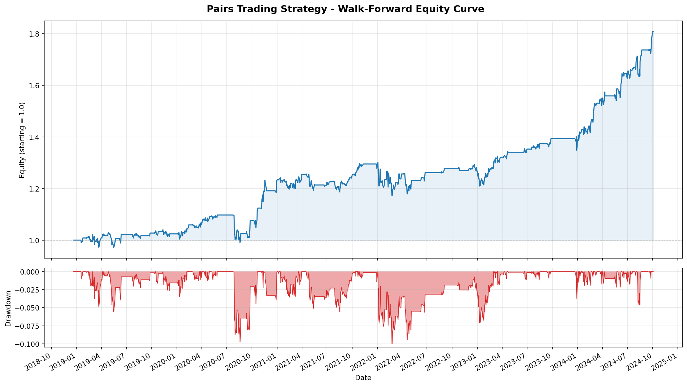
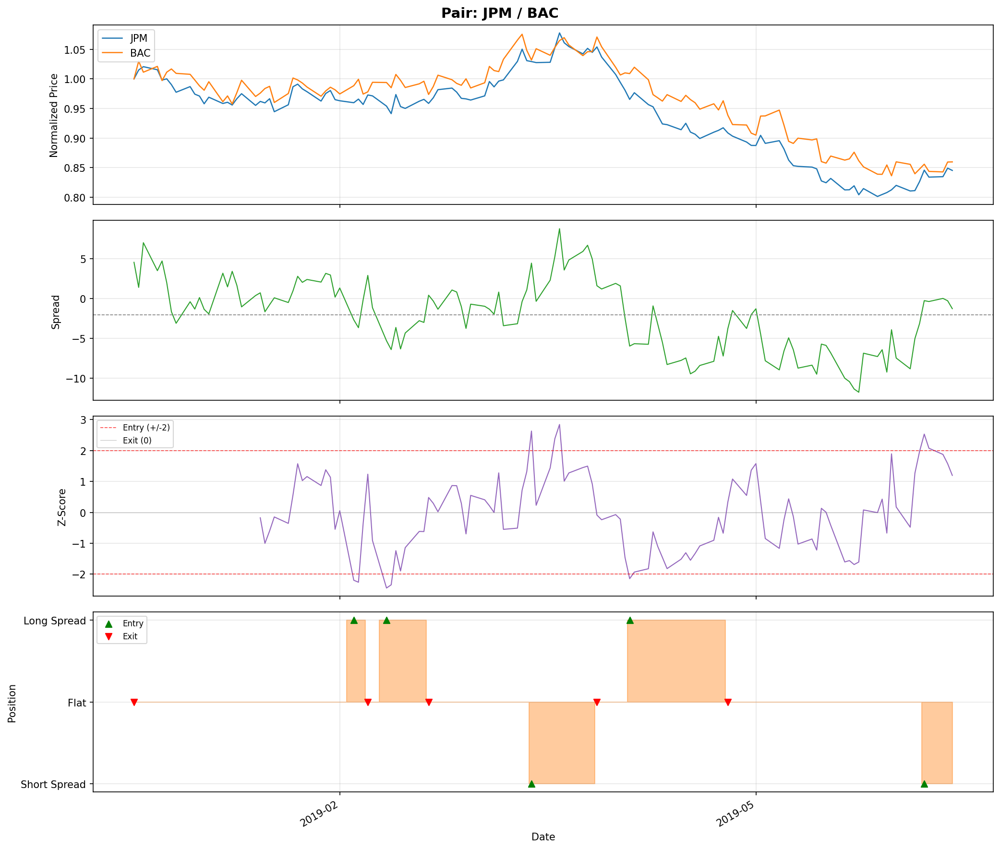
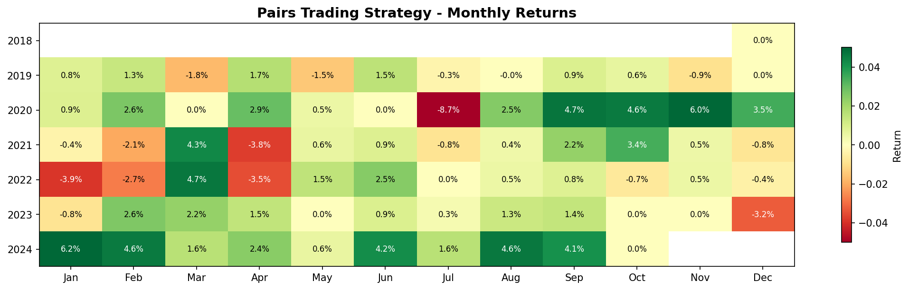

# pairs-trading-backtest

Pairs trading strategy on equity data with cointegration-based pair selection, z-score signals, walk-forward backtesting, and performance analytics.

## Features

- **Data**: Fetches adjusted close prices from Yahoo Finance (with synthetic fallback)
- **Pair Selection**: Engle-Granger cointegration test plus ADF stationarity confirmation on the spread, across all ticker combinations
- **Signals**: Z-score based entry/exit with configurable thresholds
- **Backtesting**: Walk-forward with rolling formation/trading windows and transaction costs
- **Metrics**: Sharpe ratio, max drawdown, CAGR, Calmar ratio, win rate
- **Visualization**: Equity curve with drawdown, pair signal plots, monthly returns heatmap

## Results

Default run (10 large-cap tickers, 2018-2024, walk-forward 252/126 days, 10 bps costs):

- **Sharpe ratio:** 0.96
- **CAGR:** 10.38%
- **Max drawdown:** 9.96%

### Equity curve



### Example pair signals (JPM / BAC, window 0)



### Monthly returns



> Note: in environments without Yahoo Finance access, the data layer falls back to synthetic cointegrated price series, which is what produced the numbers above.

## Setup

```bash
pip install -r requirements.txt
```

## Usage

Run with defaults (10 large-cap tickers, 2018-2024):

```bash
python run_backtest.py
```

Customize parameters:

```bash
python run_backtest.py \
  --tickers XOM CVX KO PEP JPM BAC \
  --start 2019-01-01 \
  --end 2024-06-30 \
  --formation-period 252 \
  --trading-period 126 \
  --entry-z 2.0 \
  --exit-z 0.5 \
  --cost-bps 10 \
  --max-pairs 3
```

Skip plot generation:

```bash
python run_backtest.py --no-plots
```

## Project Structure

```
pairs_trading/
  __init__.py
  data.py             # Yahoo Finance data fetching + synthetic fallback
  cointegration.py    # Engle-Granger tests, pair selection, spread/hedge ratio
  signals.py          # Rolling z-score, entry/exit signal generation
  backtest.py         # Single-pair and walk-forward portfolio backtesting
  metrics.py          # Sharpe, drawdown, CAGR, Calmar, win rate
  visualization.py    # Equity curve, signal plots, monthly heatmap
run_backtest.py       # CLI entry point
requirements.txt
```

## How It Works

1. **Formation Window**: On each rolling window, run a two-step pair selection on all ticker pairs (Engle-Granger cointegration on the price levels, followed by an Augmented Dickey-Fuller (ADF) test on the spread residuals to confirm stationarity) and keep the most statistically significant pairs
2. **Hedge Ratio Estimation**: Fit OLS regression to estimate the hedge ratio between each cointegrated pair
3. **Trading Window**: Compute the out-of-sample spread using the estimated hedge ratio, generate z-score signals, and simulate trades
4. **Portfolio**: Equal-weight across selected pairs, chain trading windows together
5. **Transaction Costs**: Applied as basis points on each position change
