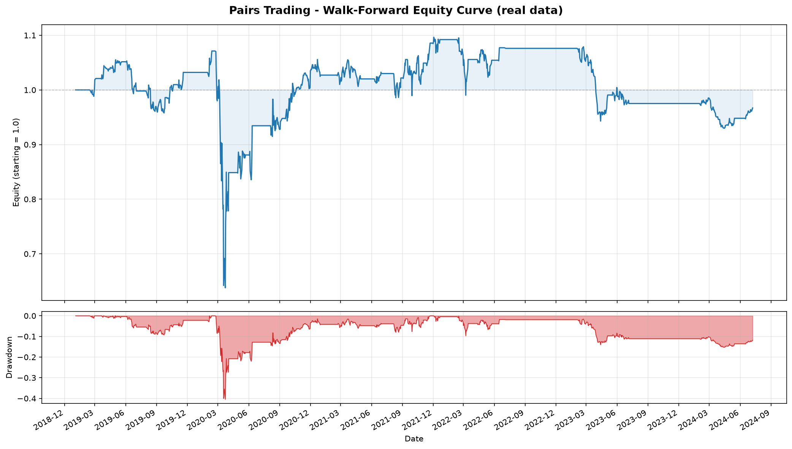
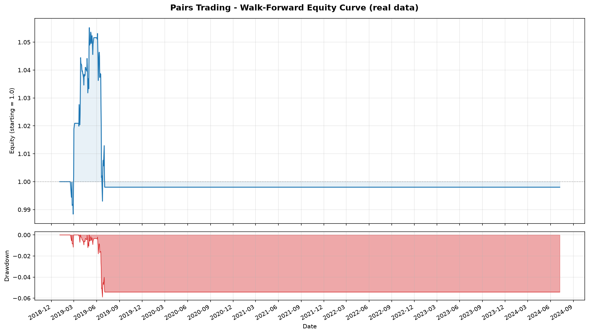

# pairs-trading-backtest

A cointegration pairs-trading strategy on US large caps that **does not work**, and the
three statistical bugs that made it look like it did.

This repository used to advertise a Sharpe of 0.96 on public equity data. That number
was false. What follows is the correction, the diagnosis, and the real result. I have
left every broken code path in the repo behind a flag, so each claim below can be
re-run and falsified rather than taken on my word.

---

## Correction notice

The previous README said:

> Default run (10 large-cap tickers, 2018-2024, walk-forward 252/126 days, 10 bps costs):
> **Sharpe ratio: 0.96 - CAGR: 10.38% - Max drawdown: 9.96%**

and the repository description said the strategy was tested "on public equity data".

**Those numbers were not produced by public equity data.** `fetch_prices()` in
`pairs_trading/data.py` wrapped its Yahoo Finance call in a bare `except` and, on any
failure, silently returned `generate_synthetic_prices()`. That generator builds each
consecutive pair of tickers from a shared stochastic trend plus an **injected AR(1)
mean-reverting spread**. `DEFAULT_TICKERS` is ordered `XOM, CVX / KO, PEP / JPM, BAC / …`,
so the "cointegrated pairs" the strategy proudly discovered were the pairs the data
generator had manufactured two function calls earlier.

The strategy was not finding cointegration in the market. It was finding cointegration
in its own random number generator. Every performance figure in the old README came from
that path.

The silent fallback is gone. `fetch_prices` now raises `DataFetchError`; if the download
fails the program exits non-zero. Synthetic data is opt-in behind `--synthetic`, where it
does the one honest job it is good for: acting as a labelled answer key to test the pair
selector.

---

## The real result

Same tickers, same window, same parameters, same code - on real Yahoo Finance data:

|                | Claimed (synthetic) | **Actual (real data)** |
|----------------|--------------------:|-----------------------:|
| Sharpe ratio   | 0.96                | **0.07**               |
| CAGR           | 10.38%              | **-0.61%**             |
| Max drawdown   | 9.96%               | **40.46%**             |
| Annual vol     | - | **20.13%**             |
| Worst day      | - | **-18.65%**            |

```
PERFORMANCE METRICS (real market data)
--------------------------------------------------------------------
Total Return:           -3.30%
Annual Return:          -0.61%
Annual Volatility:      20.13%
Sharpe Ratio:             0.07
Max Drawdown:           40.46%
Calmar Ratio:            -0.02
Win Rate:               47.62%
Trading Days:             1386
```

Reproduce with `python run_backtest.py --correction none --criterion original`.

A 40% drawdown and an 18.6% single-day loss on a book that is supposed to be
market-neutral is the tell. This was never a low-risk strategy; the 9.96% max drawdown
was an artifact of a spread that mean-reverted because it had been built to.

**On the Sharpe of 0.07 alongside a CAGR of -0.61%:** these are not inconsistent. The
mean daily return is +0.0057%, which annualises arithmetically to +1.45%, but daily
volatility is 1.27% and the volatility drag (-σ²/2 ≈ -2.03% per year) more than eats it.
Sharpe is computed on arithmetic returns, CAGR on compounded ones. A strategy can have a
positive Sharpe and still destroy capital. Reporting only the Sharpe would have hidden
that, which is exactly the sort of thing this README is trying to stop doing.



The drawdown is concentrated in March 2020. A genuinely market-neutral book should not
care much about a market-wide crash; a book of spurious pairs, each of which is really a
naked directional bet dressed up as a hedge, cares enormously.

---

## Diagnosis

### 1. The book is filled with false positives

With 10 tickers the selector runs **C(10,2) = 45 cointegration tests per formation
window**, each at α = 0.05, with **no multiple-testing correction**, and then trades the
top `max_pairs = 3`.

If *nothing* in the universe were cointegrated, 45 uncorrected tests at α = 0.05 would
still be expected to produce **2.25 false rejections per window** by chance alone. Three
slots to fill, 2.25 free false positives per window: the book can be filled end to end
with noise without a single genuine relationship existing.

That is not a theoretical worry. It is what happens. Measured over the 11 formation
windows (`python run_diagnostics.py`):

```
window  formation end     naiveADF   EG raw   EG+BH  EG+Bonf
------------------------------------------------------------------------------
0       2019-01-02               2        2       2        1
1       2019-07-03               2        1       0        0
2       2020-01-02              10        7       0        0
3       2020-07-02               4        4       0        0
4       2020-12-31               9        1       0        0
5       2021-07-02              14        1       0        0
6       2021-12-31              13        6       0        0
7       2022-07-05               2        0       0        0
8       2023-01-03               7        2       0        0
9       2023-07-06               3        0       0        0
10      2024-01-04               8        1       0        0
------------------------------------------------------------------------------
mean                          6.73     2.27    0.18     0.09

Expected false rejections per window if NOTHING is cointegrated: 2.25
Actually observed per window, Engle-Granger uncorrected:          2.27
```

**2.27 observed against 2.25 expected under the null.** The uncorrected selector finds
almost exactly as many "cointegrated" pairs as pure chance would produce in a universe
containing no cointegration whatsoever. The selection process carries essentially no
information.

And it shows in what got traded. The original run's book includes **GLD/MSFT** (a gold
ETF against Microsoft), **JPM/SLV** (a bank against silver) and **MSFT/SLV at a hedge
ratio of -6.74**. There is no economic story in which Microsoft is a hedge for silver at
six-to-one. These are not pairs. They are the 2.25 expected false positives, wearing
tickers.

### 2. The "stricter two-test confirmation" was a false-positive generator

The old README advertised a two-step filter: Engle-Granger, then "an ADF test on the
spread residuals to confirm stationarity", described as *"a stricter two-test
confirmation"*.

`adf_test()` applied **standard Dickey-Fuller critical values to the residuals of an
estimated cointegrating vector**. Those critical values assume the series being tested is
observed. Here it is a fitted residual: OLS picked the hedge ratio precisely to minimise
its variance, i.e. to make it look as stationary as possible. The unit-root statistic is
therefore biased toward rejection. This is exactly the distortion that Engle-Granger /
MacKinnon critical values exist to absorb.

The consequence is the opposite of what was claimed. Measured:

```
Was the ADF 'confirmation' a stricter second test?
  Pairs Engle-Granger accepted across all windows: 25
  Of those, rejected by the naive ADF step:        0
  The second test filtered out 0 pairs. It was inert: it
  over-rejects so heavily (74 rejections vs Engle-Granger's 25)
  that it is never the binding constraint.
```

**The second test rejected zero of the 25 pairs the first test accepted.** It fired 74
times where a correctly-sized test fires 25. It was not a filter, it was a rubber stamp - and had it ever been the binding constraint it would have *added* false positives, not
removed them. Selection now uses `statsmodels.tsa.stattools.coint`, which applies
MacKinnon critical values that account for the estimated vector.

### 3. There was no stop-loss

The strategy enters at |z| ≥ 2 and exits when the spread reverts to its mean. If the
spread never reverts - the normal fate of a pair that was selected by a false-positive
test and was never cointegrated to begin with - **there is no exit condition at all.**
The position is held while the spread runs. That is the mechanism behind the 40.46%
drawdown and the -18.65% day.

A `--stop-loss-z` option now closes a position when |z| exceeds a threshold, on the view
that a spread stretching further is evidence *against* the mean-reversion thesis that
justified the trade. A stopped pair is retired for the rest of the trading window and
re-tested at the next formation window. (Writing the test for this caught a bug in my own
first version: simply flattening the position re-entered on the very next bar, because
|z| beyond the stop is also beyond the entry threshold. That is not a stop-loss, it is a
round-trip cost applied to the same losing trade.)

---

## After fixing all three

All rows below are real data, identical parameters, differing only in the selection rule
(`python run_diagnostics.py`):

```
variant                                pairs  flat  Sharpe     CAGR   MaxDD     Vol
------------------------------------------------------------------------------
ORIGINAL rule (EG and naive ADF)          17     2    0.07  -0.61%  40.46%  20.13%
naive ADF alone                           30     0   -0.15  -4.85%  40.46%  20.03%
Engle-Granger alone, uncorrected          17     2    0.07  -0.61%  40.46%  20.13%
+ Benjamini-Hochberg (FDR)                 2    10   -0.01  -0.04%   5.89%   2.14%
+ Bonferroni (FWER)                        1    10   -0.57  -1.31%   8.99%   2.27%
BH + stop-loss at |z|=3                    2    10    0.37   0.64%   2.34%   1.75%
```

`pairs` = pair-windows traded. `flat` = windows where no pair survived selection, so the
book sat in cash.

Two things worth reading carefully.

**First, the original rule and uncorrected Engle-Granger are the same row.** Identical
Sharpe, identical drawdown, identical 17 pair-windows. That is the proof that the ADF
"confirmation" step never did anything.

**Second, and this is the actual result: once the multiple-testing correction is applied,
there is essentially nothing left to trade.** Benjamini-Hochberg leaves **2 pair-windows
across seven years**. Ten of the eleven windows select no pair at all and sit in cash.
Only **75 of 1,386 days** carry any position.

So the corrected strategy does not lose much money - but only because it almost never
trades. That is not a fixed strategy. It is a strategy that has been correctly told it
has no edge.

**The `BH + stop-loss` row shows Sharpe 0.37 and I want to be explicit that this is not a
result.** It rests on 75 days of exposure in a single formation window. The standard
error on a Sharpe estimated from that much data is far larger than the estimate. I am
reporting it because it is what the code prints, not because I believe it. Anyone quoting
"Sharpe 0.37" from this repo would be repeating the original sin in a smaller font.

Note also *which* pairs survive BH: **GLD/MSFT** and **MSFT/SLV**. Even after correction,
the only survivors are economically absurd. The most likely reading is that these are
residual false positives that BH could not kill, not a discovery. A correction procedure
cannot manufacture signal in a universe that has none; it can only stop you from trading
noise, and here it stops you from trading almost everything.



That flat line is the corrected result. It is not a bug in the plot. It is ten of eleven
windows in which the selector, once it is required to account for the 45 tests it just
ran, correctly declines to trade anything.

### The honest conclusion

**Over 2018-2024, on this universe of 10 large caps and ETFs, with this methodology, I
find no evidence of tradeable cointegration.** The apparent edge in the original version
came from three sources, in descending order of importance: simulated data standing in
for market data, 45 uncorrected hypothesis tests per window, and a confirmation test that
confirmed nothing. Remove them and the strategy has nothing to trade.

That is a negative result. It is the correct one.

---

## The synthetic generator, repurposed

The generator that caused all this has exactly one legitimate use: it knows which pairs it
made cointegrated, so it can be used as an answer key to test the selector. `--synthetic`
now runs that test - and produces no performance number of any kind.

`python run_backtest.py --synthetic` builds 20 independently seeded universes, each with 4
pairs cointegrated by construction and 41 null pairs, and scores each selection rule:

```
Mean over 20 universes
selection rule                             picked   true  false  recall FP rate
------------------------------------------------------------------------------
ORIGINAL rule (EG and naive ADF)             8.45   3.55   4.90    89%  12.0%
naive ADF alone (wrong crit values)         12.20   3.75   8.45    94%  20.6%
Engle-Granger alone, uncorrected             8.45   3.55   4.90    89%  12.0%
Benjamini-Hochberg + EG (default)            5.00   3.15   1.85    79%   4.5%
Bonferroni + EG                              3.05   2.85   0.20    71%   0.5%
------------------------------------------------------------------------------
PASS: default selector recovers 3.15/4 true pairs per universe
      and cuts mean false positives from 4.90 (original rule) to 1.85.
```

The run **asserts** that the corrected selector recovers the truly cointegrated pairs and
selects strictly fewer false positives than the shipped rule; it exits non-zero otherwise.

The naive ADF row is the bug in one line: **20.6% of the pairs that are not cointegrated
by construction** are selected as cointegrated, against a nominal 5%. Correct critical
values plus BH bring that to 4.5%, and Bonferroni to 0.5% - at a real cost in recall
(89% → 79% → 71%), which is the trade you are actually making when you choose FDR over
FWER, and FWER over nothing.

**The residual 4.5% under BH is not a bug, and I am not going to pretend it is zero.** BH
controls the false discovery rate under independence or positive regression dependence.
These 45 tests are drawn from only 10 underlying series, so they are strongly dependent - if one series happens to wander in a mean-reverting way, every pair containing it is
pulled toward rejection together. BH is approximate here. Bonferroni is valid under
arbitrary dependence, which is why both are offered.

(An earlier version of this harness scored a *single* synthetic universe, and I was about
to write its false-positive count into this README as if it were a rate. One draw tells
you what happened once. Hence 20 seeds.)

---

## What I would do differently

- **Test the universe, not the pairs.** 45 tests to find 3 pairs is a bad ratio. A
  sensible design picks candidate pairs on economic grounds first (same sector, same
  supply chain, share-class arbitrage) and tests a handful, or uses a Johansen procedure
  on a small, motivated basket.
- **Cointegration is not stable.** A pair that cointegrates over a 252-day formation
  window frequently does not over the next 126 days. Half of the risk management problem
  is detecting that break, which is what the stop-loss crudely approximates.
- **The costs are optimistic.** 10 bps round-trip, no borrow cost on the short leg, no
  slippage, no market impact, and mid-price fills. A short leg in SLV is not free.
- **Prices, not log prices.** The cointegrating regression is run on price levels, so the
  hedge ratio is not scale-invariant and drifts as the price level drifts.
- **No universe-selection audit.** I chose these 10 tickers because they *look* like they
  should cointegrate. That is itself a researcher degree of freedom I did not account for.

---

## Setup

```bash
pip install -r requirements.txt
```

## Usage

Real data, corrected methodology (default):

```bash
python run_backtest.py
```

Reproduce the original, broken result on real data:

```bash
python run_backtest.py --correction none --criterion original
```

Measure each bug separately (produces the tables above):

```bash
python run_diagnostics.py
```

Validate the selector against labelled synthetic data:

```bash
python run_backtest.py --synthetic
```

Run the tests:

```bash
pytest tests/
```

Key flags:

| Flag | Meaning |
|---|---|
| `--correction {bh,bonferroni,none}` | Multiple-testing control across the C(n,2) tests. `none` reproduces the original bug. |
| `--criterion {mackinnon,naive_adf,original}` | Which test to select on. `mackinnon` is correct; the other two reproduce the original bugs. |
| `--stop-loss-z Z` | Close a position when \|z\| exceeds Z. Off by default. |
| `--synthetic` | Run the selector validation harness on labelled simulated data. |

If Yahoo Finance is unreachable, `run_backtest.py` **exits non-zero**. It will not
substitute simulated data. That behaviour is what this repository is a monument to.

## Project structure

```
pairs_trading/
  data.py             # Yahoo Finance fetch (raises on failure) + labelled synthetic generator
  cointegration.py    # Engle-Granger, BH / Bonferroni correction, hedge ratio
  signals.py          # Rolling z-score, entry/exit/stop-loss
  backtest.py         # Single-pair and walk-forward portfolio backtesting
  metrics.py          # Sharpe, drawdown, CAGR, Calmar, win rate
  validation.py       # Scores the selector against the synthetic answer key
  visualization.py    # Equity curve, signal plots, monthly heatmap
run_backtest.py       # CLI entry point
run_diagnostics.py    # Measures each bug on real data
tests/
```

## Method

1. **Formation window** (252 days): run C(n,2) Engle-Granger tests, apply Benjamini-Hochberg
   across them, keep up to `max_pairs` survivors.
2. **Hedge ratio**: OLS on the formation window, frozen thereafter.
3. **Trading window** (126 days): out-of-sample spread from the frozen hedge ratio, rolling
   20-day z-score, enter at |z| ≥ 2, exit at z = 0, optional stop at |z| ≥ `stop_loss_z`.
4. **Portfolio**: equal weight across selected pairs. Windows with no surviving pair are
   held flat at zero return - they are not dropped from the series.
5. **Costs**: 10 bps applied to each position change.
